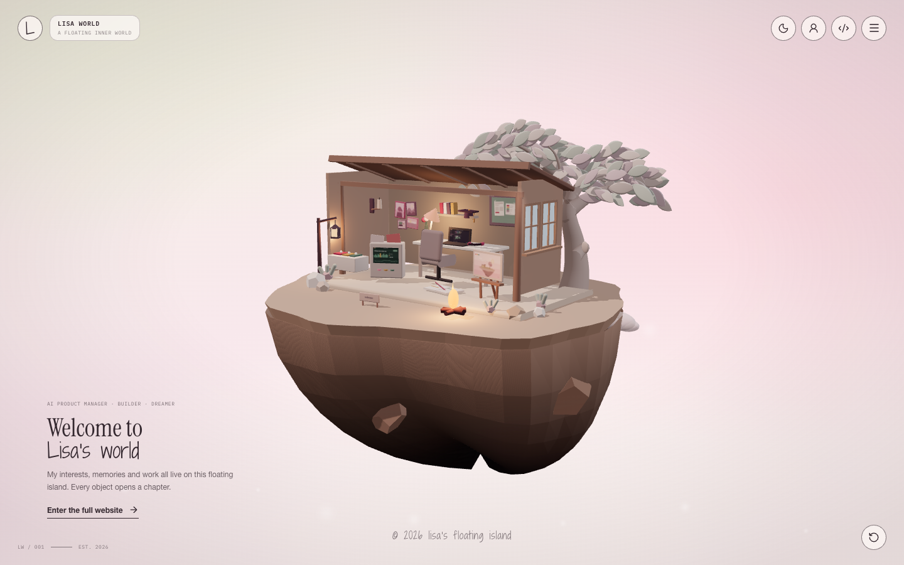
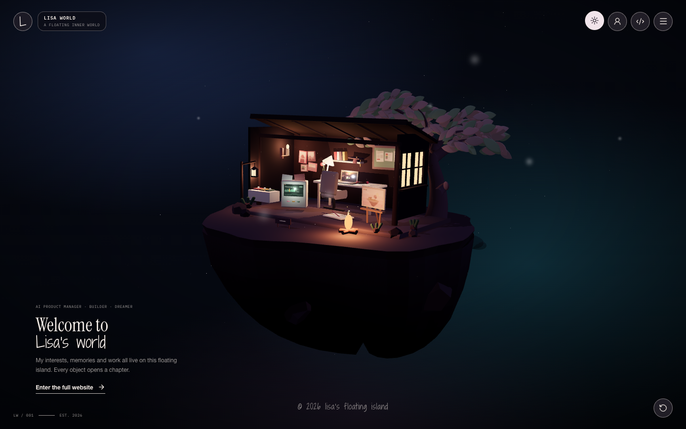

# Lisa's Floating Island

An interactive personal world: a low-poly island floating in a soft sky, with a
cutaway cabin on top. Every object in the cabin opens a chapter of Lisa's story.
Built with React, TypeScript, Three.js and React Three Fiber — all geometry is
generated in code, so there are no model files to download.

Live: <https://lisayinyy.github.io/floating_island/>

| Day | Night |
| --- | --- |
|  |  |

## What it does

- **One scene, six chapters.** Clicking the laptop, easel, photo wall, console,
  graduation cap or prototype deck opens that chapter and leans the camera in on
  the object.
- **Day and night.** Not just a palette swap: at night the campfire, hanging
  lantern, desk lamp, candle, two cabin windows and the lit screens become the
  only real light sources, and the sky turns navy-into-teal with stars and
  drifting embers.
- **Cinematic entrance.** The camera starts close on the cabin and pulls back to
  the home framing, then the island keeps a slow idle float that also reacts to
  the pointer.
- **Respects the visitor.** It opens in the theme their operating system asks
  for and remembers the one they pick. `prefers-reduced-motion` skips the
  entrance and the float *and the second-long dolly into every chapter* — the camera
  is written straight to its mark instead, so the same framing arrives without
  the ride. Orbit angles are clamped so the scene can never be turned inside out,
  and the layout has a dedicated phone framing.
- **Usable without a mouse.** Each 3D object owns a real focusable button, so
  tabbing raises its label and Enter opens the chapter; Escape closes the menu
  sheet, then the panel.
- **The island introduces itself where hover cannot.** Hover is what tells a
  desktop visitor the island is clickable. A touch screen has no equivalent, so
  the intro copy promised "every object opens a chapter" and then left a phone
  visitor to guess which shapes those were. On a device where `(hover: hover)` is
  false, each label now appears once in chapter order, one at a time — nothing
  moves, nothing opens, and it never happens again on that device.
- **Labels are a constant, readable size.** They used to be drawn through drei's
  `distanceFactor`, which scales with camera distance. That is right for scenery
  and wrong for interface: at the home framing — the one view where a visitor is
  deciding what to click — `SELECTED WORK` came out as a 29x8 pixel smudge, and
  19x5 on a phone. Only one label is ever shown at a time, so a constant size
  cannot collide with its neighbours.
- **The photo wall is one target, not four.** Its frames have deliberate gaps
  between them, and a tap at the middle of the wall went between two frames and
  opened nothing — on a phone that made it the one chapter of six a real tap
  could not reach. It now carries an invisible plane spanning the frames, which
  is what padding is for. The graduation cap had the milder version of the same
  problem: it is a board, a head and a tassel dangling off to one side, so its
  outline is mostly air and a grid of real taps across it opened its chapter 7
  times out of 16. It got a box the size of its own silhouette, and now scores 12.
  Neither hit area is inflated to a comfortable finger size, because on a phone
  all six chapter objects live inside a cluster 173x108 pixels across — the island
  is already as wide as the screen — so padding one to 44px would take taps from
  its neighbours. Pointing at an object is a desktop pleasure; on a phone the
  labels and the menu are the reliable way in, which is what the island's
  self-introduction is for.
- **Screens that show something.** The laptop and the AI console are painted with
  Canvas2D textures — an editor mid-edit and a generation dashboard — because the
  chapter views fly close enough that a blank pane was the least finished surface
  on the island.
- **Painted artwork, not placeholder shapes.** The easel carries a painting of the
  island itself, the photo wall holds four different pictures, and the board above
  the desk is a working moodboard. All six are Canvas2D textures for the same
  reason as the screens: a circle and two bars stood in for a painting, and the
  chapter close-up showed it.
- **Things that reward poking.** The campfire flares when you click it, the
  hanging lantern can be snuffed out and relit, and the tree leans away from your
  pointer on top of its own idle wind. None of it is announced, none of it is a
  setting, and all of it goes still under `prefers-reduced-motion`.
- **A silhouette hidden behind one key.** Pressing `S` flattens the whole island
  to a single dark tone while every flame, candle, lit window and screen keeps
  burning — the reference site's silhouette, borrowed as an easter egg instead of
  a default. It is never saved, because it is a thing you do, not a mode you keep.
- **Framing is measured, never hand-written.** Chapter cameras are derived from a
  live bounding-sphere measurement of the object, and *where* the object sits is
  derived from the chapter panel's own rectangle — whatever the panel leaves free
  is where the object goes, at whatever size fits. Floating labels sit at the
  measured top of each object. Hand-written numbers drifted three times: the
  easel's aim point ended up 1.85 units off the easel, the laptop's label floated
  up beside the graduation cap on the shelf above it, and the phone's framing slot
  was tuned against a 560px panel that later grew to 494 of 844 pixels and ate the
  object's lower half.
- **The interface gets out of the way of the island.** Opening a chapter hides
  the home-view furniture — the corner index and the signature have nothing to
  say while a panel is talking, and a plate or a glow to rescue their contrast
  would only add clutter. The reset-camera button stays, because it still does
  something. The wordmark keeps a frosted pill behind it instead: it is a link,
  it cannot leave, and the `about` close-up puts it flat against the cabin's
  brown back wall.

## Design language

The visual direction is a study of [plantpot.studio](https://www.plantpot.studio)
by Akira Haga, adapted to a site that has to keep interactive content readable:

| Borrowed | How it is applied here |
| --- | --- |
| Island fully inside the frame, never cropped | One `homeFraming` table in `src/scene/World.tsx` sizes desktop and phone framing; every tween reads from it |
| Silhouette-first lighting: a dark mass against a soft sky | Ambient and hemisphere fill are kept low in *both* themes; warm light only exists at the fire, lantern and desk lamp |
| Irregular rock, not a turned cone | `src/scene/islandGeometry.ts` generates a flat-shaded, deterministic, asymmetric rock mass with boulders breaking the outline |
| A cabin silhouette | A cutaway shed roof with rafters and posts (`CabinShell`), open at the front so every object stays visible |
| Layered pastel sky plus vignette | Stacked CSS radial gradients on `.app-shell`, with an alpha WebGL canvas in front of them |
| Foreground bokeh dust | A CSS `.dust` layer of blurred drifting motes, on top of the in-world sparkles |
| Full-screen frosted navigation | `.menu-sheet` blurs the island behind big handwritten chapter links |
| One handwritten accent face | `Shadows Into Light Two` for the wordmark, chapter list and signature; `IBM Plex Mono` for interface text; `Instrument Serif` for headlines |
| Custom loading screen | Two counter-rotating dotted rings with a mono caption, painted from a ~17 kB entry chunk so it appears before three.js has downloaded |
| A single warm window in a dark mass | The right end wall is framed timber around two real openings (`WindowWall`); after dark the panes are the island's brightest note |
| Theme follows the system, then the visitor | `resolveInitialTheme()` reads `localStorage` first and `prefers-color-scheme` second; an inline script in `index.html` applies it before React mounts, so night visitors never see a white flash |
| Object placed against the reading column, not centred | Where a chapter puts its object is derived from `.content-panel`'s measured rectangle: docked right on a desktop, docked bottom on a phone, and the object takes the middle of whatever is left |
| Labels that read as part of the world | Kept the ink-on-paper card and the handwritten-adjacent mono, dropped the distance scaling: interface has to stay readable at the framing where it is used |
| A near-black island silhouette | Available on demand: `S` swaps every material for one flat dark tone, skipping anything genuinely emissive, so the mass reads as a shape with a few warm points inside it |

Where it deliberately differs: plantpot's island is a near-black silhouette,
which works because its home page carries no content. This island has six
clickable objects, so the default view keeps the interior lit and legible while
the exterior mass carries the silhouette — and the full silhouette lives behind
the `S` key for anyone who wants it. Flattening the scene with a single
`scene.overrideMaterial` was tried first and rejected: it turned the open-fronted
cabin into one solid black rectangle and the sparkles into black specks.

## Performance notes

`three` is ~725 kB minified and cannot be split, so the fix was to stop it
blocking first paint. `src/scene/Stage.tsx` is behind `React.lazy` and
`vite.config.ts` groups vendors into `react` / `three` / `r3f` / `gsap` chunks,
which leaves a ~17 kB entry that renders the shell and loading rings immediately.
Group order in that config is load-bearing — a group also absorbs the
dependencies of what it matches, so listing `r3f` first pulled react *and* three
into one 1.1 MB chunk. The Canvas then mounts one painted frame after the loader,
so WebGL init cannot block the frame the loader is in.

**Fonts are self-hosted**, and that turned out to matter more than the 725 kB
bundle. Six latin woff2 subsets, 84 kB, in `public/fonts/`, declared inline in
`index.html`. The Google Fonts request they replaced cost a DNS lookup, a TLS
handshake and a stylesheet round trip before the first font byte — and because a
pending stylesheet blocks script execution, it delayed this site's own JavaScript
too. Measured on the built site, served locally:

| | Google Fonts | Self-hosted |
| --- | --- | --- |
| DOMContentLoaded | 767 ms | 37 ms |
| Renderer chunks start downloading | 774 ms | 66 ms |

First contentful paint is 112 ms in a plain headless browser. The QA harness
reports ~2.2 s for the same build because it rasterises everything, page included,
in software — a number worth knowing about the harness, not about the site.

Lights are counted, not sprinkled: the day theme uses 9 and night 13, and the
screen-glow lights only exist at night, because a forward renderer pays for every
light on every lit fragment.

## Development

```bash
npm install
npm run dev      # vite dev server
npm run build    # tsc -b && vite build
npm run lint     # oxlint
```

## Visual regression pass

The scene has no DOM to assert against, so QA renders it in headless Chromium
with software WebGL and checks the failures that have actually happened here:

- the entrance never finishing, or the loading screen never lifting (procedural
  scenes never report `progress === 100`, so this one is a real trap)
- a canvas that draws nothing but sky, or a menu or chapter panel that will not
  open
- **a chapter that frames the wrong thing.** `window.__ISLAND_PROBE__` raycasts
  from the live camera to points sampled on the object a chapter claims to show.
  This caught the AI console sitting in a pocket of the room the camera could
  never see into: every visit to that chapter framed a blank wall.
- **a chapter that frames its object badly.** The same probe reports the object's
  screen position, the fraction of the frame it covers, and its box in CSS
  pixels, and all three are asserted — including against the chapter panel's own
  rectangle, because on a phone the panel is docked over the island and "visible"
  is no use if the object is behind the thing describing it. "Visible" was never
  the whole requirement: the easel was perfectly unobstructed, it was just a
  speck floating in empty sky.
- **a chapter that frames its object off to one side.** Clearing the panel is not
  the same as being composed against it, so the free band beside (or above) the
  panel is measured and the object's gaps on either side of it have to match
  within 25%. This is the assertion that caught a 350px error the same afternoon
  it was written; the older "lands on its framing slot" version passed straight
  through it.
- **a stalled context, reported instead of fatal.** Every browser context here
  needs its own WebGL context, and creating one under a software renderer can take
  tens of seconds. Three suites back to back on a loaded machine pushed a later
  one past the 90s readiness ceiling, and because the wait was a bare
  `wait_for_selector` the run died on a traceback and reported none of the checks
  it had already answered. A timeout is worth exactly one failed check.
- **a camera that never arrived, reported as such.** The wait for a chapter's
  camera to land used to run out of tries and hand back the mid-flight probe
  without complaint. That surfaced about once in thirty chapter opens as a wildly
  off-centre framing — a real failure message about an imaginary bug, pointing at
  the camera arithmetic instead of at the stall. The cause is gsap's default
  `lagSmoothing(500, 33)`: when a frame takes longer than half a second it
  advances the tween by only 33ms, so under a software renderer whose frames cost
  two seconds a 1.05s flight genuinely takes tens of seconds. Turning smoothing
  off was tried and reverted — it made the tween complete in one jump, which left
  OrbitControls' damping to finish the move and put the camera *near* its mark
  instead of on it, the same failure as the zero-duration tween below. So the
  harness waits long enough for a stalled renderer, and a camera that never
  arrived now fails as a camera that never arrived.
- **the primary interaction, with a real pointer.** Every other chapter check
  clicks the floating label's DOM node, which bypasses hit testing entirely — so
  for six rounds nothing verified that pointing at a thing on the island opens
  it. A real mouse click and a real touch tap at the centre of each object's own
  projected box found the hole immediately: five of six chapters worked on a
  phone, and the sixth was the photo wall's gap. This runs from the home view for
  each chapter, because that is where a visitor points from — and it needs the
  camera to have actually arrived, since a probe taken mid-flight put two of six
  objects outside the viewport and looked exactly like a bug in the site.
- **a middle solid enough to point at.** The probe fires a grid of rays through
  the central quarter of each object and reports what fraction land on it, and the
  suite requires 0.6. Both real defects sat below that: the photo wall scored 0.0
  and the graduation cap 0.59. The click itself aims at the roomiest hit rather
  than the centre of the box — the centre of the easel's box sits a pixel from the
  gap beside its crossbar, and because the island bobs, one tap in four missed a
  target the probe had just called solid. Twelve real clicks then passed twelve
  times out of twelve. That miss was a harness aiming problem and was fixed in the
  harness; the two hollow middles were the site's problem and were fixed in the
  scene, and telling those apart is the whole point of measuring the middle
  separately from the click.
- **a label big enough to read.** Measured at the home framing, where the smudge
  version was 22x7 pixels and this asserts 55x16.
- **the island introducing itself on a touch device.** In its own context,
  because it exists precisely where `(hover: hover)` is false: the six labels have
  to appear in chapter order, never two at once, and not at all on a second
  visit.
- **the loading screen actually leaving.** For six rounds this was a class-name
  check — `is-done` present, therefore dismissed — and the class lands a frame
  before the computed style follows it. The loader is a full-screen plate over
  the island, so it is now measured: computed opacity and visibility, plus a hit
  test at the middle of the viewport. A control that pins the finished loader at
  `opacity: 1` proves it: the class-name version still reported "dismissed".
- **a chapter panel that is actually readable.** Every other chapter assertion
  treats the panel as a rectangle to clear and compose against, and all of it
  stays true of a panel at zero opacity — which is a live risk, because the panel
  arrives on a CSS animation and one missing `animation-fill-mode` would leave
  the words invisible while the layout behaved perfectly.
- **the reduced-motion path, in its own browser context.** It is the branch
  nobody looks at, and it had been shipping a 1.05s dolly for five rounds. The checks
  are: the island still arrives, the dust is gone, the camera lands in under
  0.9s, the chapter still frames its object, and the cut lands where the framing
  aimed. That last one exists because the first attempt at "cut" was a
  zero-duration tween — and a zero-duration tween never fires `onUpdate`, so
  `controls.update()` never ran and OrbitControls' damping dragged the camera
  back toward its stale internal state. Every other check still passed while the
  easel sat 350px right of its mark. Its checks are also the reason this context
  now asserts its own screenshot: every other thing it knows comes from
  JavaScript — a flight flag, a raycast against the scene graph — and all of that
  is true of a page that never painted a pixel. For one round the context's only
  artefact was a flat plate of loading screen while all five checks passed.
- **the right chapter opening at all.** A probe answers about the object it was
  asked about whether or not that chapter is on screen, so the panel's eyebrow is
  checked against the label that was clicked before any conclusion is drawn about
  the framing.
- **a scene that quietly stopped building.** `window.__ISLAND_STATS__` reports
  mesh, triangle, light, painted-screen and painted-artwork counts, so a blank
  laptop pane or a missing window light fails a check rather than a screenshot
  review.
- theme persistence, a dark OS preference, and keyboard-only chapter access
- **anything arriving from a third party.** Every byte has to come from this
  page's own origin; an `@import` that reintroduces a font CDN is one line long
- **the hidden things still being there.** The silhouette key, the campfire poke
  and the lantern toggle are each asserted by sampling the colour spread and mean
  brightness of a region before and after — silhouette has to collapse the tone
  count (235 → 56 distinct buckets), poking the fire has to make its corner
  brighter, and snuffing the lantern has to make its corner darker. Clicks are
  aimed with `window.__ISLAND_AT__(name)`, which projects a named object to CSS
  pixels, because the island floats and any hard-coded coordinate is only correct
  until something moves.
- **lists that agree with each other.** The menu sheet has to read `00`–`06` in
  order. It ran `00 02 06 05 01 03 04` for three rounds, because the order was a
  second hand-written list that had drifted from the chapter numbers.
- **the link's own presentation.** The favicon resolving under the project
  subpath, and a `summary_large_image` card at the right dimensions. Both fail
  silently and neither appears in any screenshot of the page — the favicon
  shipped for a while was a scaffold's purple lightning bolt.

180 checks at the time of writing, across desktop and phone, day and night, plus
a reduced-motion pass and two real-pointer passes (mouse and touch). The camera checks wait for the tween to settle rather than
sleeping a fixed 4.2s — under software WebGL a 1.05s tween can take several
wall-clock seconds, and a mid-flight probe once reported the easel covering 117%
of the frame when it settles at 40%. Settling means *seen moving, then seen stopping*: an earlier
version accepted two matching samples, which is also true before the tween
starts.

```bash
npm run build
python qa/verify.py qa/shots     # writes screenshots + qa/shots/qa-results.json
```

Requirements: a Python environment with `playwright` (plus `playwright install
chromium`) and `pillow`. Chromium is launched with
`--use-angle=swiftshader --enable-unsafe-swiftshader`; without those flags a
headless browser cannot create a WebGL context and only captures the loading
state. `qa/shot.py` is the lighter variant that just captures day/night frames
on desktop and phone.

## Structure

```text
src/
├── App.tsx                    Shell, theme wiring and the loading screen
├── interface/Overlay.tsx      HTML layer: topbar, hero, menu sheet, chapter panels
├── scene/
│   ├── Stage.tsx              The Canvas, lazy-loaded so three.js is off the entry path
│   ├── World.tsx              Lighting, framing tables, entrance, orbit, QA probes
│   ├── Room.tsx               The cabin shell, its windows and everything inside
│   ├── FloatingIsland.tsx     Island body, tree, lantern, campfire, signage
│   ├── islandGeometry.ts      Deterministic island geometry generators
│   ├── screenTexture.ts       Canvas2D screens and painted artwork
│   ├── objectRegistry.ts      Chapter id → group, plus live object measurement
│   ├── motion.ts              One place that reads prefers-reduced-motion
│   ├── stats.ts               Types for the window debug hooks
│   └── InteractiveObject.tsx  Hover, keyboard access and floating labels
├── store/worldStore.ts        Active chapter, theme resolution, silhouette toggle
└── App.css                    Sky gradients, dust, menu sheet, panels, loader
public/fonts/                  Six self-hosted latin woff2 subsets (OFL, 84 kB)
qa/
├── verify.py                  Headless WebGL regression pass
├── share_card.py              Captures public/share-card.png from the real scene
└── shot.py                    Quick day/night screenshots
```

Geometry is intentionally procedural and deterministic — fixed trigonometric
harmonics rather than `Math.random`, so the island is identical on every load and
can be diffed from a screenshot.

## Deployment

Pushing to `main` triggers `.github/workflows/deploy.yml`, which builds and
publishes `dist/` to GitHub Pages. `vite.config.ts` uses `base: './'` so the
bundle works from a project subpath.

## Credits

Design study of [plantpot.studio](https://www.plantpot.studio) (Akira Haga).
Built by [Lisa](https://lisayinyy.github.io/personal_web/).

Typefaces, self-hosted under the SIL Open Font License 1.1 — full text and
copyright holders in [`public/fonts/OFL.txt`](public/fonts/OFL.txt):
[IBM Plex Mono](https://github.com/IBM/plex),
[Instrument Serif](https://fonts.google.com/specimen/Instrument+Serif) and
[Shadows Into Light Two](https://fonts.google.com/specimen/Shadows+Into+Light+Two).
